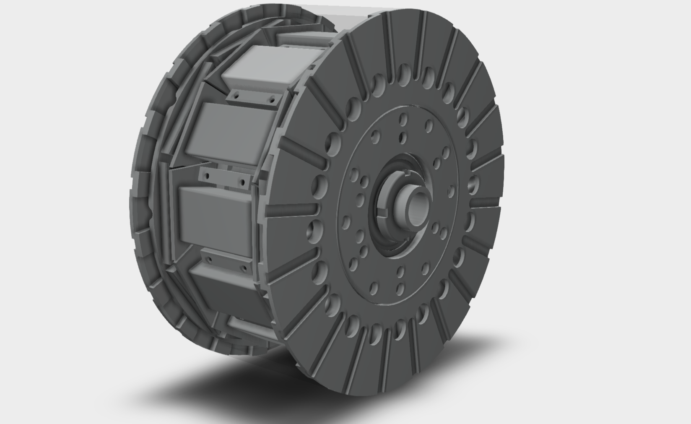
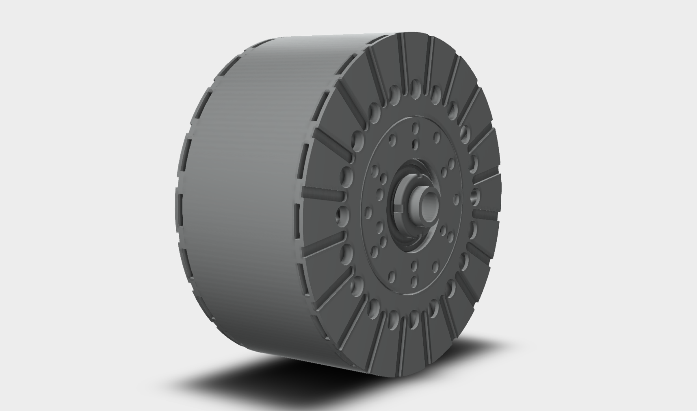
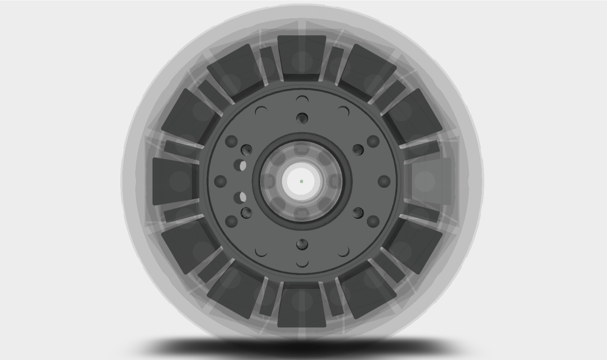

# Axial Flux Electric Motor
But an open source one!

## Intro
Hi everyone!

Github seemed like a great place to start collaborating on this project. This was designed entirely on [FreeCAD](https://github.com/FreeCAD) so I thought it appropriate to give back and share with whoever's out there who would to build one of their own. Axial flux motors are mad expensive. In my opinion, I think they are easiest to build as a hobby grade motor. I am also looking for input on the same so feel free to submit PR. 

## Specifications
| Machine Parameter | Value | Unit |
| ----------- | --------: | ----: |
| Overall Diameter | 169 | mm |
| Rotor Width | 65 | mm |
| Outer Diameter | 150 | mm |
| Inner Diameter | 100 | mm |
| Airgap length | 1.50 | mm |
| Number of Poles | 10 | * |
| Number of Stator segments | 12 | * |
| Number of Phases | 6 | * |
| Magnet Type | N42UH | * |
| Max magnet working temp | 180 | °C | 
| Number of magnets | 60 | (10 * 3 segments on each side) | 
| Encoder/Actuator | RLS RM44SI0011B10F2F10 / RMH06A3A02 | * | 
| Stator/Rotor Material | Aluminium 6068 | * |
| Conductor (Wire) gauge | 19 | AWG |
| Target RPM | 6000 | RPM |
| Bearing | 6204-2Z | 2 pcs |
| Stator segment material | TBD | * |
| Cooling fluid | 50-50 | volumetric water-glycol mix |

The rest of machine parameters can be explored in the FreeCAD file `.FCStd`.

For the Encoder, I would like to use a [Rotary Magnetic Encoder](https://www.rls.si/eng/rm44-rm58) from RLS. A hall sensor might do but the fact that I would (personally) want to use [EM-Drive 500](https://www.emdrive-mobility.com/portfolio/emdrive-500/) means that this rotary encoder (position sensor) is ideal.

Of course, since this is a 3 phase motor, it should work with any reasonable controller.

## Things I'm yet to do
 - [ ] Tap holes that should have screws/bolts going inside them.
 - [ ] Thread the main shaft.
 - [ ] Figure out what off the shelf lock nut to use for the main shaft.
 - [ ] Figure out how to to make it IP68.
 - [ ] Figure out how to cool the magnets from the outside of the rotor using ambient air (I'm thinking of implementing an impeller design).
 - [ ] Position the back iron to prevent flux leak. Or exlude the backiron in favor of halback array to reduce moment of inertia. I can't see it offering any, if much, mechanical advantage to the working of this machine.
 - [ ] FEM analysis for everything (rotor, stator, fluid flow for cooling, magnetic interactions, heat generation etc). This will optimise the design. Everything you see here has a tonne of guess work.
 - [ ] Assemble the whole thing from [FreeCAD](https://github.com/FreeCAD).
 - [ ] Figure out the max torque (Suggestions are welcome. No idea how to do this).
 - [ ] Figure out max power (Suggestions are welcome. No idea how to do this).
 - [ ] Figure out ideal number of turns per stator segment.
 - [ ] Figure out phase resistance.
 - [ ] Figure out inductance.
 - [ ] Figure out how to scale the overall diameter of the machine for different applications, voltage, amperage, torque and power numbers.

`Some of the items like inductance and phase resistance are purely to have this project well documented. I still don't know what these are and how they affect the working and choice of material for the motor`

## Some considerations
I noticed all articles (that I could get my hands on) about axial flux machines always mention the manufacturing complexity of segment cores; especially if they are trapezoidal in shape. While I understand cores need to be laminated to reduce eddy currents, the shape may not be ideal to manufacture let alone assemble by using sheets. We need different thinking.

I propose a simple solution: Think of how 18650 cylindrical cells are packaged. We could use the same idea: laminated ferrite cylinders of about 1 mm in diameter - held together firmly using some epoxy. 

The advantages (I assume) are obvious here:

- One can shape the core to a trapezoidal shape quite easily using a simple 3D printed or machined mould. Place the laminated cylinders in the axial direction of the flux and pour in some epoxy to cure. After, simply cut the segments to desired length. ¯\\_(ツ)_/¯
- The surface for eddy currents to form is significanly more distributed compared to sheets.

I'd love to engage with someone who has knowledge on this and possibly do some simulations. I'm a hobbyist at best.

## Some Inpiration
I'm not sure if there are any open source axial flux motor designs out there (Didn't bother checking after I noticed this thing has so much gatekeeping). I prefer Axial flux because of the high power density and the tools to manufacture all of these parts are an internet search away: especially on [alibaba.com](https://alibaba.com). Induction motors that Tesla Motors uses are way more complex to manufacture.

[Benjamin Vedder](https://github.com/vedderb), the creator of the open source VESC controller gave us a gift by open sourcing a motor controller (I'd love to configure one to my specific use case one day :)). We should extend the same to complete the loop for hobby EV builders :).

### Two Companies
[Yasa Motors](https://www.yasa.com/) (Now owned by Mercedes Benz) and [Emrax](https://emrax.com/) are both European. Their motors are hard to get a hold of and outrageously expensive. And if you're really looking you'll barely find much information about them. Emrax is mostly used by FSAE teams from what I gather. Their tech should be in the hands of more people in my opinion but whatever. Here we are. Check out this article: [Emrax motor teardown](https://build-its-inprogress.blogspot.com/2017/05/emrax-motor-teardown.html)

## License
This design is open-sourced _hardware_ licensed under the [MIT license](https://opensource.org/licenses/MIT). (*we can find the hardware equivalent later lol!*)

## Creator
Eugene Wang'ombe  
Twitter: [tweetat_g](https://twitter.com/tweetat_g)  
Email: engineering@huskberry.com  
Country: 🇰🇪 Kenya  

## More images

